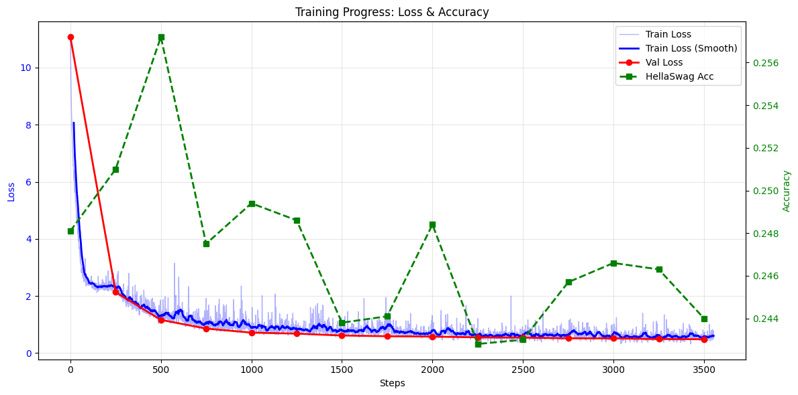

# Developed-LLM-from-Scratch

## 1. About The Project

This repository contains my personal research project aimed at **building a large language model (LLM) from scratch**. The entire implementation is grounded in the original GPT-2 architecture and the foundational principles of the Transformer model.

I have been closely following the landmark paper [“Attention Is All You Need”](https://arxiv.org/abs/1706.03762) (Vaswani et al., 2017) – which introduced the Transformer – as well as Andrej Karpathy's excellent educational series on YouTube, particularly his [“Let’s build GPT: from scratch, in code, spelled out.”](https://www.youtube.com/watch?v=kCc8FmEb1nY) video.

The goal of this project is **not** to produce a production-ready chatbot, but rather to gain deep, hands-on understanding of how modern generative language models work under the hood: from data preprocessing and tokenization to the Transformer decoder blocks, self-attention, and training dynamics.

By sharing this work, I hope it can serve as a useful reference for others who are also learning to build LLMs from the ground up.

## 2. Dataset

I use https://huggingface.co/datasets/hirine/dataset-van-ban-phap-luat-381K-samples

## 3. Model & Training Configuration

| Parameter                | Value                                 | Rationale / Reason                                                                                                                                                                                                                                                                                 |
| ------------------------ | ------------------------------------- | -------------------------------------------------------------------------------------------------------------------------------------------------------------------------------------------------------------------------------------------------------------------------------------------------- |
| **`block_size` (T)**     | 1024                                  | Maximum sequence length – kept as the original GPT-2 setting to balance context window and memory.                                                                                                                                                                                                 |
| **`vocab_size`**         | 50257                                 | GPT-2 tokenizer: 50,000 BPE merges + 256 byte tokens + 1 `<\|endoftext\|>` token. We reuse this tokenizer as it works decently for Vietnamese text (byte-level BPE) and avoids training a new tokenizer.                                                                                           |
| **`n_layer`**            | 12                                    | Number of Transformer layers – defines the depth of the 124M GPT-2 model.                                                                                                                                                                                                                          |
| **`n_head`**             | 12                                    | Number of attention heads per layer – standard for GPT-2 small.                                                                                                                                                                                                                                    |
| **`n_embd`**             | 768                                   | Embedding dimension – sets the width of the model, following the 124M GPT-2 configuration.                                                                                                                                                                                                         |
| **Total batch size**     | 262,144                               | Number of tokens processed per optimizer step. Chosen as a multiple of `B × T × ddp_world_size` (8×1024×2=16,384) to satisfy gradient accumulation requirements. Smaller than the original 524K to increase update frequency, which helps learning from a relatively small dataset (~300M tokens). |
| **Micro batch size (B)** | 8                                     | Samples per GPU per forward pass. Reduced from the default 16 to avoid CUDA Out‑of‑Memory on GPUs with 16 GB VRAM (e.g., T4).                                                                                                                                                                      |
| **`grad_accum_steps`**   | 16                                    | Automatically computed: `total_batch_size // (B × T × ddp_world_size) = 262144 // (8×1024×2)`. This simulates a larger batch without exceeding GPU memory.                                                                                                                                         |
| **`max_lr`**             | 6e‑4                                  | Peak learning rate – standard for GPT‑2 124M pre‑training, known to give stable convergence.                                                                                                                                                                                                       |
| **`min_lr`**             | 6e‑5                                  | Minimum learning rate (10% of `max_lr`) for cosine decay schedule.                                                                                                                                                                                                                                 |
| **`max_steps`**          | 5,720                                 | Number of training steps for **5 epochs**. Each epoch corresponds to ~1,144 steps (estimated: ~300M train tokens / 262,144 ≈ 1,144). Adjust when the exact token count is known.                                                                                                                   |
| **`warmup_steps`**       | 228                                   | 4% of `max_steps` (rounded). Linearly warms up the learning rate from zero to `max_lr` to stabilize early training.                                                                                                                                                                                |
| **Optimizer**            | AdamW (fused)                         | Decoupled weight decay regularization (`weight_decay=0.1`) to help prevent overfitting on the small legal text corpus.                                                                                                                                                                             |
| **Mixed precision**      | `bfloat16`                            | Uses `torch.autocast` with `bfloat16` to reduce memory and accelerate training on supported GPUs.                                                                                                                                                                                                  |
| **DDP**                  | 2 GPUs                                | Distributed Data Parallel with `nccl` backend to leverage both GPUs.                                                                                                                                                                                                                               |
| **Dataset**              | Vietnamese legal texts (381K samples) | Custom dataset tokenized with the GPT‑2 tokenizer. First shard reserved for validation, remaining shards for training.                                                                                                                                                                             |

# Method

## 1 Gradient Accumulation:

Since high-performance Transformers require large batch sizes for stable convergence, but physical GPU memory (VRAM) is limited, we employ Gradient Accumulation.

The Mechanism: Instead of updating model weights after every micro-batch, we perform multiple forward and backward passes, accumulating the gradients in the .grad tensors. The optimizer step is only triggered once the accumulated tokens reach the total_batch_size.

The Benefit: This allows us to simulate a massive batch size (e.g., 262,144 tokens) on consumer or professional GPUs (like the RTX 5090), ensuring a smoother loss curve and better approximation of the true data distribution without "Out of Memory" (OOM) errors.

Example: With a micro_batch_size (B) of 8 and sequence_length (T) of 1024, one GPU processes 8,192 tokens per step. To reach a target of 262,144 tokens, we accumulate gradients for 32 steps (or 16 steps if using 2 GPUs) before updating weights.

## 2 Distributed Data Parallel (DDP)

To accelerate training time, this project leverages Distributed Data Parallel via torchrun.

The Mechanism: DDP spawns independent processes for each GPU. Each process holds a complete copy of the model but operates on a unique subset of the data.

Synchronization: After the backward pass, DDP performs an All-Reduce operation. This communication step averages the gradients across all GPUs, ensuring that every model instance remains identical after the optimizer update.

Efficiency: Unlike the older DataParallel, DDP avoids the "Master Node" bottleneck by utilizing dedicated communication backends (like NCCL), resulting in near-linear scaling of training speed as more GPUs are added.

# Performance

The model's convergence was monitored using cross-entropy loss and the HellaSwag benchmark to evaluate zero-shot common sense reasoning capabilities.

<p align="center">
  
  <br>
  <em>Figure 1: Training Loss and HellaSwag Accuracy over 5,720 steps. 
  The smooth decline in loss demonstrates the effectiveness of the chosen learning rate schedule and gradient accumulation.</em>
</p>

# How to run ?

Follow these steps to set up the environment and reproduce the training process.

### Step 1: Installation

Ensure you have Python 3.10+ and PyTorch installed. Install the remaining dependencies via pip:

```bash
pip install torch datasets tqdm inspect tiktoken
```

### Step 2 : Data Preprocessing

```bash
python3 Vietnamese_Legal.py
```

### Step 3: Training with DDP

```bash
# Recommended for multi-GPU setups (e.g., 2x RTX 5090)
torchrun --standalone --nproc_per_node=<Num_GPU> Train_GPT.py
```
